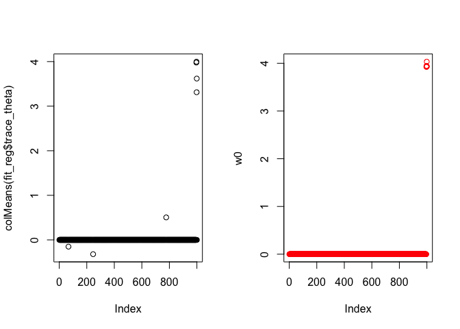
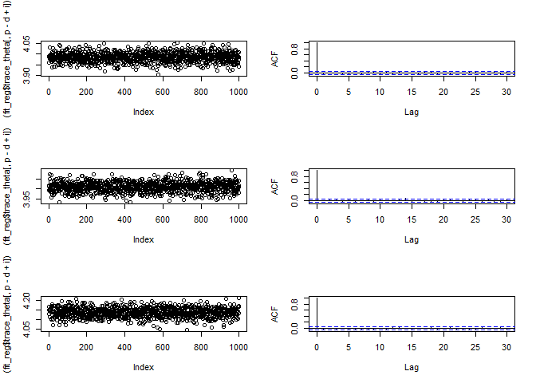
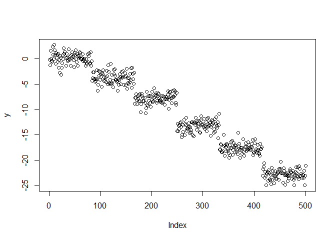
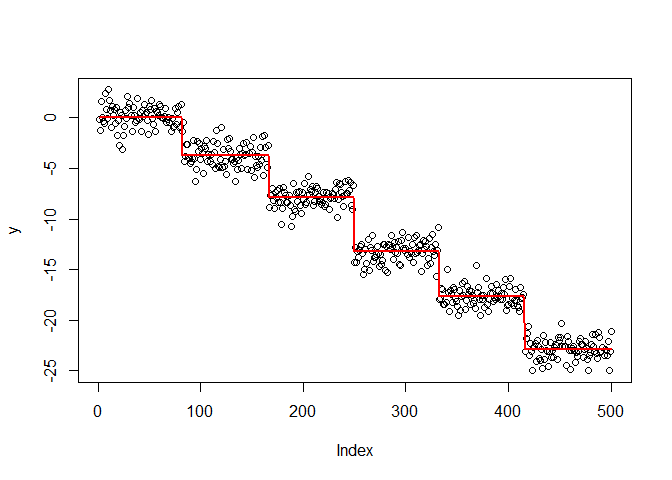
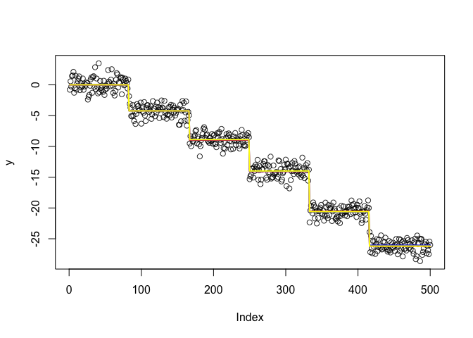
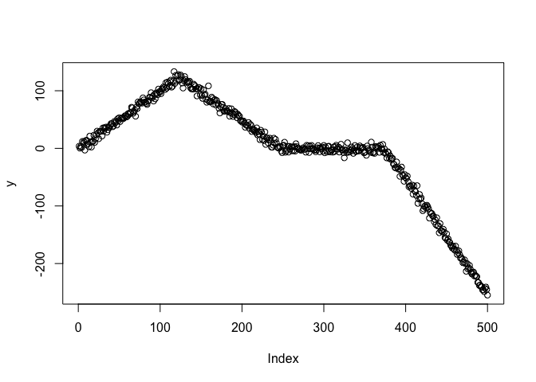
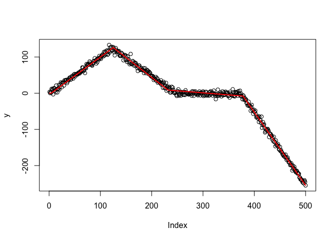
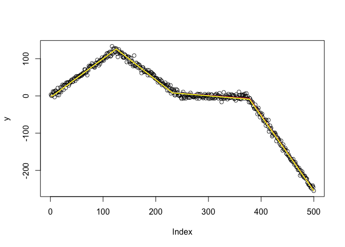

Illustration of L1-ball Prior
================

## Sparse Regression

Generate the data \(n=200, p=1000\)

``` r
n = 200
p = 1000
X <- matrix(rnorm(n*p),n,p)
d =5
w0 <-    c(rep(0, p-d), rnorm(d)*0.1 +4)
y = X%*% w0 + rnorm(n,0,.5)
```

``` r
fit_reg <- l1ball(y, X, steps = 1000,burnin = 2000)
```

    ## [1] 0.22 0.48
    ## [1] 100
    ## [1] 0.10 0.04
    ## [1] 0.02 0.08
    ## [1] 200
    ## [1] 0.10 0.06
    ## [1] 0.10 0.02
    ## [1] 300
    ## [1] 0.10 0.18
    ## [1] 0.12 0.10
    ## [1] 400
    ## [1] 0.2 0.2
    ## [1] 0.14 0.02
    ## [1] 500
    ## [1] 600
    ## [1] 700
    ## [1] 800
    ## [1] 900
    ## [1] 1000
    ## [1] 1100
    ## [1] 1200
    ## [1] 1300
    ## [1] 1400
    ## [1] 1500
    ## [1] 1600
    ## [1] 1700
    ## [1] 1800
    ## [1] 1900
    ## [1] 2000
    ## [1] 2100
    ## [1] 2200
    ## [1] 2300
    ## [1] 2400
    ## [1] 2500
    ## [1] 2600
    ## [1] 2700
    ## [1] 2800
    ## [1] 2900
    ## [1] 3000

Compare the posterior mean vs the oracle

``` r
par(mfrow=c(1,2))  
plot(colMeans(fit_reg$trace_theta))
plot(w0,type='p',col='red')
```

<!-- -->

Check the convergence of Markov chain

``` r
par(mfrow=c(3,2))  
for(i in 1:3){
  plot((fit_reg$trace_theta[,p-d+i]))
  acf((fit_reg$trace_theta[,p-d+i]), main='')
}
```

<!-- -->

\#\#Change point detection

Generate the data

``` r
p = 500
n = 500
d = 5
idx = floor(seq(1,n,length.out=(d+2))[2:(d+1)])
w0 <- rep(0, p)
w0[idx] =  -( rnorm(length(idx)) + 5)
X <- matrix(1, p, p)
X[upper.tri(X)] = 0
y = X%*%w0 + rnorm(p)*1
plot(y)
```

<!-- -->

``` r
fit_changepoint <- l1ball(y, X, steps = 1000,burnin = 2000)
```

    ## [1] 0.40 0.44
    ## [1] 100
    ## [1] 0.24 0.20
    ## [1] 0.32 0.18
    ## [1] 200
    ## [1] 0.24 0.24
    ## [1] 0.28 0.24
    ## [1] 300
    ## [1] 0.24 0.22
    ## [1] 0.20 0.24
    ## [1] 400
    ## [1] 0.14 0.10
    ## [1] 0.20 0.16
    ## [1] 500
    ## [1] 600
    ## [1] 700
    ## [1] 800
    ## [1] 900
    ## [1] 1000
    ## [1] 1100
    ## [1] 1200
    ## [1] 1300
    ## [1] 1400
    ## [1] 1500
    ## [1] 1600
    ## [1] 1700
    ## [1] 1800
    ## [1] 1900
    ## [1] 2000
    ## [1] 2100
    ## [1] 2200
    ## [1] 2300
    ## [1] 2400
    ## [1] 2500
    ## [1] 2600
    ## [1] 2700
    ## [1] 2800
    ## [1] 2900
    ## [1] 3000

Plot the Data vs Fitted (posterior mean)

``` r
theta_mean <- colMeans(fit_changepoint$trace_theta)

plot(y)
lines(X%*%theta_mean,col="red", lwd=2)
```

<!-- -->

Plot the Data vs a few random sample

``` r
idx = sample(c(1:1000),3)
theta1 <- fit_changepoint$trace_theta[idx[1],]
theta2 <- fit_changepoint$trace_theta[idx[2],]
theta3 <- fit_changepoint$trace_theta[idx[3],]

plot(y, col = rgb(red = 0, green = 0, blue = 0, alpha = 0.8))
lines(X%*%theta1,col="red", lwd=2)
lines(X%*%theta2,col="blue", lwd=2)
lines(X%*%theta3,col="yellow", lwd=2)
```

<!-- -->

## Linear trend filter

Generate the data

``` r
n = 500
p = 500
d = 3

idx = floor(seq(1,n,length.out = (d+2))[2:(d+1)])

X= matrix(0,n,n)
for (i in c(1:n)){
  for (j in c(1:i)){
    X[i,j] = abs(j-i)+1
  }
}
X[,1]=1

# there are 4 line segments

idx= c(2,idx)

w0 = rep(0,p)
w0[idx] = (c(1,-2,1,-2))
psi = X%*%w0

y = psi + rnorm(n)*10
plot(y)
```

<!-- -->

Fit the model (note: this requires longer run time)

``` r
fit_linear_trend <- l1ball(y, X, steps = 1000,burnin = 5000)
```

    ## [1] 0.46 0.54
    ## [1] 100
    ## [1] 0.68 0.40
    ## [1] 0.50 0.38
    ## [1] 200
    ## [1] 0.52 0.26
    ## [1] 0.46 0.28
    ## [1] 300
    ## [1] 0.52 0.28
    ## [1] 0.60 0.26
    ## [1] 400
    ## [1] 0.46 0.20
    ## [1] 0.60 0.18
    ## [1] 500
    ## [1] 0.64 0.16
    ## [1] 0.40 0.06
    ## [1] 600
    ## [1] 0.60 0.24
    ## [1] 0.42 0.22
    ## [1] 700
    ## [1] 0.50 0.14
    ## [1] 0.40 0.26
    ## [1] 800
    ## [1] 0.52 0.04
    ## [1] 0.50 0.16
    ## [1] 900
    ## [1] 0.46 0.14
    ## [1] 0.46 0.14
    ## [1] 1000
    ## [1] 0.52 0.06
    ## [1] 0.36 0.22
    ## [1] 1100
    ## [1] 0.64 0.18
    ## [1] 0.54 0.26
    ## [1] 1200
    ## [1] 0.40 0.32
    ## [1] 1300
    ## [1] 1400
    ## [1] 1500
    ## [1] 1600
    ## [1] 1700
    ## [1] 1800
    ## [1] 1900
    ## [1] 2000
    ## [1] 2100
    ## [1] 2200
    ## [1] 2300
    ## [1] 2400
    ## [1] 2500
    ## [1] 2600
    ## [1] 2700
    ## [1] 2800
    ## [1] 2900
    ## [1] 3000
    ## [1] 3100
    ## [1] 3200
    ## [1] 3300
    ## [1] 3400
    ## [1] 3500
    ## [1] 3600
    ## [1] 3700
    ## [1] 3800
    ## [1] 3900
    ## [1] 4000
    ## [1] 4100
    ## [1] 4200
    ## [1] 4300
    ## [1] 4400
    ## [1] 4500
    ## [1] 4600
    ## [1] 4700
    ## [1] 4800
    ## [1] 4900
    ## [1] 5000
    ## [1] 5100
    ## [1] 5200
    ## [1] 5300
    ## [1] 5400
    ## [1] 5500
    ## [1] 5600
    ## [1] 5700
    ## [1] 5800
    ## [1] 5900
    ## [1] 6000

Plot the Data vs Fitted (posterior mean)

``` r
theta_mean <- colMeans(fit_linear_trend$trace_theta)

plot(y)
lines(X%*%theta_mean,col="red", lwd=2)
```

<!-- -->

Plot the Data vs a few random sample

``` r
idx = sample(c(1:1000),3)
theta1 <- fit_linear_trend$trace_theta[idx[1],]
theta2 <- fit_linear_trend$trace_theta[idx[2],]
theta3 <- fit_linear_trend$trace_theta[idx[3],]

plot(y, col = rgb(red = 0, green = 0, blue = 0, alpha = 0.8))
lines(X%*%theta1,col="red", lwd=2)
lines(X%*%theta2,col="blue", lwd=2)
lines(X%*%theta3,col="yellow", lwd=2)
```

<!-- -->
